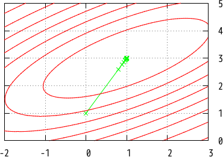

Demonstration: Gradient-based optimization
===============================================

In mathematics, optimization (minimization or maximization of a function) is
important foundation applied for many fields such as information science,
economics, bioinformatics, and physics.
It is difficult to analytically solve optimization problem because a target
function is very complex in practical cases. We often rely on numerical or
approximation method to obtain a good solution in such cases.
In this article, we introduce practical gradient-based approaches (Steepest
descent, Newton method, and Quasi-Newton method) for optimization
problems and how to implement them by
[Sized Linear Algebra Package (SLAP)](http://akabe.github.io/slap/).
You can implement the methods as easy as other linear algebra libraries.

In this article, we consider minimization problem defined as
$$y = \\min\_{\\bm{x}\\in\\R^n} f(\\bm{x})$$
where $f : \\R^n\\to\\R$ is a target function.
Minimization problem can be converted into maximization problem by replacing
$f(\\bm{x})$ with $-f(\\bm{x})$.
A target function can be non-convex, but must be differentiable.
We compute a _minimal_ point instead of an exact minimum point of a target
function since the latter is hard.
Gradient-based approaches use the _gradient_ of a target function for minimization:
$$\\bm{\\nabla}f = \\left(\\frac{\\partial f}{\\partial x_1},\\dots,\\frac{\\partial f}{\\partial x_n}\\right)^\\top.$$
Thus we need to compute $\hat{\bm{x}}$ such that $\bm{\nabla} f(\hat{\bm{x}}) = \bm{0}$.

Preliminary
-----------

First, load SLAP on OCaml REPL or [utop](https://github.com/diml/utop)
(`#` at the head of each line is prompt):

```OCaml
# #use "topfind";;
# #require "slap";;
# #require "slap.top";;
# #require "slap.ppx";;
# open Format;;
# open Slap.D;;
# open Slap.Io;;
```

Second, define target function $f$ you want to minimize.
In this article, we choose a Gaussian function as a target:
$$f(\bm{x})=-\exp\left(\frac{1}{2}(\bm{x}-\bm{b})^\top\bm{A}(\bm{x}-\bm{b})\right)$$
where
$$\bm{A}=\begin{pmatrix}
-0.1&0.1\\\\0.1&-0.2\\\\
\end{pmatrix},\quad
\bm{b}=(1.0,3.0)^\top.$$
Note that $\bm{A}$ is symmetric, and the minimum is -1 at (1, 3).
<figure>

<figcaption>Fig 1. The target function in this demonstration</figcaption>
</figure>

The Gaussian function is implemented as follows:

```OCaml
# let gauss a b x =
    let xb = Vec.sub x b in
    ~-. (exp (dot xb (symv a xb) /. 2.0));;
val gauss : ('a, 'a, 'b) mat -> ('a, 'c) vec -> ('a, 'd) vec -> float = <fun>
```

where [dot]({{ site.baseurl }}/api/Slap_D.html#VALdot) is
a Level-1 BLAS function
and [symv]({{ site.baseurl }}/api/Slap_D.html#VALsymv) is
a Level-2 BLAS function.
The type of `gauss` means

- the first argument is `'a`-by-`'a` matrix,
- the second argument is `'a`-dimensional vector,
- the third argument is `'a`-dimensional vector, and
- the return value has type `float`.

You can execute `gauss` by passing $\bm{A}$, $\bm{b}$ and $\bm{x}$:

```OCaml
# let a = [%mat [-0.1, 0.1;
                 0.1, -0.2]];;
val a : (Slap.Size.two, Slap.Size.two, 'a) mat =
       C1   C2
  R1 -0.1  0.1
  R2  0.1 -0.2

# let b = [%vec [1.0; 3.0]];;
val b : (Slap.Size.two, 'a) vec = R1 R2
                                   1  3

# gauss a b [%vec [0.0; 0.0]];;
- : float = -0.522045776761015934
```

However you cannot give vectors and matrices that have sizes inconsistent
with the type of `gauss` as follows:

```OCaml
gauss a b [%vec [0.0; 0.0; 0.0]];;
Error: This expression has type
         (Slap.Size.three, 'a) vec =
           (Slap.Size.three, float, rprec, 'a) Slap_vec.t
       but an expression was expected of type
         (Slap.Size.two, 'b) vec =
           (Slap.Size.two, float, rprec, 'b) Slap_vec.t
       Type Slap.Size.three = Slap_size.z Slap_size.s Slap_size.s Slap_size.s
       is not compatible with type
         Slap.Size.two = Slap_size.z Slap_size.s Slap_size.s
       Type Slap_size.z Slap_size.s is not compatible with type Slap_size.z
```

The static size checking of SLAP protects you against dimensional
inconsistency. If you get an error message like the above output,
your program possibly has a bug.

Steepest descent method
--------------------------

_Steepest descent_ (a.k.a., gradient descent) is a kind of iterative methods:
we choose an initial value $\\bm{x}^{(0)}$, and generate points
$\\bm{x}^{(1)},\\bm{x}^{(2)},\\bm{x}^{(3)},\\dots$ by
$$\\bm{x}^{(t+1)} = \\bm{x}^{(t)} - \\eta \bm{\nabla}f(\bm{x}^{(t)})$$
where $\\eta$ is a learning rate (a parameter for controlling convergence).
The above update formula is easily implemented as follows:

```OCaml
# let steepest_descent ~loops ~eta df f x =
    for i = 1 to loops do
      axpy ~alpha:(~-. eta) (df x) x; (* Steepest descent: x := x - eta * (df x) *)
      printf "Loop %d: f = %g, x = @[%a@]@." i (f x) pp_rfvec x
    done
```

Above code uses Level-1 BLAS function [axpy]({{ site.baseurl }}/api/Slap_D.html#VALaxpy).

The gradient of the target function is given by
\begin{align*}
\bm{\nabla}f(\bm{x})
&=-\exp\left(\frac{1}{2}(\bm{x}-\bm{b})^\top\bm{A}(\bm{x}-\bm{b})\right)
\frac{1}{2}(\bm{A}+\bm{A}^\top)(\bm{x}-\bm{b})\\\\
&=-\exp\left(\frac{1}{2}(\bm{x}-\bm{b})^\top\bm{A}(\bm{x}-\bm{b})\right)
\bm{A}(\bm{x}-\bm{b}).
\end{align*}

```OCaml
# let dgauss a b x = symv ~alpha:(gauss a b x) a (Vec.sub x b);;
val dgauss : ('a, 'a, 'b) mat -> ('a, 'c) vec -> ('a, 'd) vec -> ('a, 'e) vec =
  <fun>
```

`dgauss` has a type like `gauss`,
but `dgauss` returns a `'a`-dimensional vector.

Run steepest descent method as follows:

```OCaml
# steepest_descent ~loops:100 ~eta:2. (dgauss a b) (gauss a b) [%vec [0.; 1.]];;
Loop 1: f x = -0.88288, x = -0.15576 1.46728
Loop 2: f x = -0.930997, x = -0.222322 1.80448
...
Loop 99: f x = -1, x = 0.999342 2.99959
Loop 100: f x = -1, x = 0.999392 2.99962
- : unit = ()
```

Our program successfully found the minimum point (exact solution = (1, 3)).
You can control speed of convergence by changing a value of the learning rate.
<figure>

<figcaption>Fig 2. Convergence of steepest descent (100 steps)</figcaption>
</figure>

### Bisection search of learning rate by Wolfe conditions

Using too large learning rates may go through a minimal point (zigzag convergence),
but quite small learning rates slowly reach a solution.
In this section, we introduce an approach to find
a learning rate achieving fast convergence:
[Wolfe conditions](https://en.wikipedia.org/wiki/Wolfe_conditions)
are used for finding an suitable learning rate.
Wolfe conditions are

- $f(\bm{x}+\alpha\bm{p})\le
   f(\bm{x})+c\_1\alpha\bm{p}^\top\bm{\nabla}f(\bm{x})$, and
- $\bm{p}^\top\bm{\nabla}f(\bm{x}+\alpha\bm{p})\ge
   c\_2\bm{p}^\top\bm{\nabla}f(\bm{x})$

where $\bm{p}$ is a search direction, and $0<c\_1<c\_2<1$.
These conditions give the upper bound and the lower bound of
learning rate $\alpha$.
We can find a learning rate satisfying the conditions by
[bisection search](https://en.wikipedia.org/wiki/Bisection_method):

```OCaml
# let wolfe_search ?(c1=1e-4) ?(c2=0.9) ?(init=1.0) ?(upper=100.0) df f p x =
    let middle lo hi = 0.5 *. (lo +. hi) in
    let q = dot p (df x) in
    let y = f x in
    let xap = Vec.create (Vec.dim x) in
    let rec aux lo hi alpha =
      ignore (copy ~y:xap x); (* xap := x *)
      axpy ~alpha p xap; (* xap := xap + alpha * p *)
      if f xap > y +. c1 *. alpha *. q then aux lo alpha (middle lo alpha)
      else if dot p (df xap) < c2 *. q then aux alpha hi (middle alpha hi)
      else alpha
    in
    aux 0.0 upper init;;
val wolfe_search :
  ?c1:float -> ?c2:float -> ?init:float -> ?upper:float ->
  (('a, 'b) vec -> ('a, 'c) vec) ->
  (('a, 'b) vec -> float) -> ('a, 'd) vec -> ('a, 'b) vec -> float = <fun>
```

`wolfe_search ?c1 ?c2 ?init ?upper df f p x` returns a learning rate
satisfying Wolfe conditions. Optional arguments `init` and `upper`
indicate the initial value and the upper bound of bisection search.
Execution of this function becomes faster by passing suitable values
to `init` and `upper`. However, if computation cost of a target function
and its derivative is quite large, `wolfe_search` is inefficient.

The following code implements steepest descent method with automatic search
of learning rates by Wolfe conditions:

```OCaml
# let steepest_descent_wolfe ~loops df f x =
    for i = 1 to loops do
      let p = Vec.neg (df x) in
      let eta = wolfe_search df f p x in (* Obtain a suitable learning rate *)
      axpy ~alpha:eta p x;
      printf "Loop %d: f x = %g, x = @[%a@]@." i (f x) pp_rfvec x
    done;;
val steepest_descent_wolfe :
  loops:int ->
  (('a, 'b) vec -> ('a, 'c) vec) ->
  (('a, 'b) vec -> float) -> ('a, 'b) vec -> unit = <fun>
```

`steep_descent_wolfe` achieves faster convergence as follows:

```OCaml
# steepest_descent_wolfe ~loops:60 (dgauss a b) (gauss a b) [%vec [0.; 1.]];;
Loop 1: f x = -0.83552, x = -0.0778801 1.23364
Loop 2: f x = -0.877268, x = -0.135404 1.43875
...
Loop 59: f x = -1, x = 0.998372 2.99915
Loop 60: f x = -1, x = 0.999408 2.99925
```

<figure>

<figcaption>Fig 3. Convergence of steepest descent + Wolfe conditions (60 steps)</figcaption>
</figure>

The steps of naive steepest descent (described at the previous section)
gradually gets small during the iteration (see Fig 2),
but large steps appear in Fig 3 because large learning rates are sometimes chosen.
They accelerate convergence.

Newton method
-------------

Newton method (a.k.a., Newton-Raphson method) is also a kind of iterative approach using
the second derivative of a target function addition to the first:
$$\bm{x}^{(t+1)} = \bm{x}^{(t)} - \eta\Bigl(\bm{\nabla}^2 f(\bm{x}^{(t)})\Bigr)^{-1} \bm{\nabla} f(\bm{x}^{(t)}).$$
The second derivative (often called _Hessian matrix_) is defined by
$$\bm{\nabla}^2 f = \\begin{pmatrix}
\\displaystyle\\frac{\partial f}{\partial x\_1\partial x\_1}&\\cdots&
\\displaystyle\\frac{\partial f}{\partial x\_1\partial x\_n}\\\\
\\vdots&\\ddots&\\vdots\\\\
\\displaystyle\\frac{\partial f}{\partial x\_n\partial x\_1}&\\cdots&
\\displaystyle\\frac{\partial f}{\partial x\_n\partial x\_n}\\\\
\\end{pmatrix}.$$
Newton method is implemented by using [sytri]({{ site.baseurl }}/api/Slap_D.html#VALsytri)
and [symv]({{ site.baseurl }}/api/Slap_D.html#VALsymv) as follows:

```OCaml
# let newton ~loops ~eta ddf df f x =
    for i = 1 to loops do
      let h = ddf x in
      sytri h; (* h := h^(-1) *)
      ignore (symv ~alpha:(~-. eta) h (df x) ~beta:1. ~y:x); (* x := x - eta * h * (df x) *)
      printf "Loop %d: f = %g, x = @[%a@]@." i (f x) pp_rfvec x
    done;;
val newton :
  loops:int -> eta:float ->
  (('a, 'b) vec -> ('a, 'a, 'c) mat) ->
  (('a, 'b) vec -> ('a, 'd) vec) ->
  (('a, 'b) vec -> float) -> ('a, 'b) vec -> unit = <fun>
```

The Hessian matrix of the Gaussian function is given as
$$\bm{\nabla}^2f(\bm{x})=
-\exp\left(\frac{1}{2}(\bm{x}-\bm{b})^\top\bm{A}(\bm{x}-\bm{b})\right)
\left(\bm{A}(\bm{x}-\bm{b})(\bm{x}-\bm{b})^\top\bm{A}^\top+\bm{A}\right).$$

```OCaml
# let ddgauss a b x =
    let a' = Mat.copy a in
    ignore (syr (symv a (Vec.sub x b)) a'); (* a' := a' + a * (x-b) * (x-b)^T * a^T *)
    Mat.scal (gauss a b x) a';
    a';;
val ddgauss :
  ('a, 'a, 'b) mat -> ('a, 'c) vec -> ('a, 'd) vec -> ('a, 'a, 'e) mat =
  <fun>
```

where [syr]({{ site.baseurl }}/api/Slap_D.html#VALsyr) and
[Mat.scal]({{ site.baseurl }}/api/Slap_D.Mat.html#VALscal) are
BLAS functions.

Try `newton`:

```OCaml
# newton ~loops:20 ~eta:0.4 (ddgauss a b) (dgauss a b) (gauss a b) [%vec [0.; 1.]];;
Loop 1: f = -0.99005, x = 0.8 2.6
Loop 2: f = -0.996503, x = 0.881633 2.76327
...
Loop 19: f = -1, x = 0.99998 2.99996
Loop 20: f = -1, x = 0.999988 2.99998
- : unit = ()
```

<figure>

<figcaption>Fig 4. Convergence of Newton method (20 steps)</figcaption>
</figure>

Newton method finds a minimal fast, while the approach has two problems:

- Convergence of the iteration is not guaranteed if a Hessian matrix is not
  [positive-definite symmetric](http://en.wikipedia.org/wiki/Positive-definite_matrix).
  You need to give an initial point close to a minimal for finding the minimal
  because a Hessian matrix is positive-definite at points near a minimal.
  Newton method starting from an initial point far from a minimal fails.
  For example, function `newton` outputs a wrong result if you pass (0, -2) as
  an initial point since the Hessian matrix at (0, -2) is not positive-definite.
- Computation of Hessian matrix and its inverse takes high cost. In addition,
  a target function is too complex to analytically compute its Hessian matrix
  in practical cases.

Quasi-Newton method
-------------------

_Quasi-Newton method_ is like Newton method, but an approximated inverse
Hessian matrix is used. Several approximation approaches has been proposed,
while we only introduce [BFGS](https://en.wikipedia.org/wiki/Broyden%E2%80%93Fletcher%E2%80%93Goldfarb%E2%80%93Shanno_algorithm)
(Broyden-Fletcher-Goldfarb-Shanno) algorithm in this section.

Let $\bm{H}\_t$ be an approximated inverse Hessian matrix at time step $t$,
then the iteration of Quasi-Newton method is defined as
$$\bm{x}\_{t+1}=\bm{x}\_t-\eta\_t\bm{H}\_t\bm{\nabla}\bm{f}(\bm{x}\_t).$$
The inverse Hessian approximated BFGS is computed by
$$\bm{H}\_{t+1}=\bm{H}\_t
+\left(1+\frac{\bm{y}\_t^\top\bm{H}\_t\bm{y}\_t}{\bm{y}\_t^\top\bm{s}\_t}\right)
\frac{\bm{s}\_t\bm{s}\_t^\top}{\bm{y}\_t^\top\bm{s}\_t}
-\frac{\bm{H}\_t\bm{y}\_t\bm{s}\_t^\top+\bm{s}\_t\bm{y}\_t^\top\bm{H}\_t^\top}{\bm{y}\_t^\top\bm{s}\_t}$$
where $\bm{s}\_t=\bm{x}\_{t+1}-\bm{x}\_t$ and $\bm{y}\_t=\bm{\nabla}\bm{f}(\bm{x}\_{t+1})-\bm{\nabla}\bm{f}(\bm{x}\_t)$.
$\bm{H}\_0$ is an identity matrix.
A learning rate at each time step is chosen by Wolfe conditions for keeping
$\bm{H}\_t$ is positive-definite.

The following function `update_h` takes $\bm{H}\_t$, $\bm{y}\_t$ and $\bm{s}\_t$,
and destructively assigns $\bm{H}\_{t+1}$ into the memory of argument $\bm{H}\_t$
(parameter `?up` specifies using upper or lower triangular of $\bm{H}\_t$).

```OCaml
# let update_h ?up h y s =
    let rho = 1. /. dot y s in
    let hy = symv ?up h y in
    ignore (ger ~alpha:(~-. rho) hy s h); (* h := h - rho * hy * s^T *)
    ignore (ger ~alpha:(~-. rho) s hy h); (* h := h - rho * s * hy^T *)
    ignore (syr ?up ~alpha:((1. +. dot y hy *. rho) *. rho) s h)
  ;;
val update_h :
  ?up:bool -> ('a, 'a, 'b) mat -> ('a, 'c) vec -> ('a, 'd) vec -> unit = <fun>
```

Using `update_h`, Quasi-Newton method is implemented as follows:

```OCaml
# let quasi_newton ~loops df f x0 =
    let h = Mat.identity (Vec.dim x0) in (* an approximated inverse Hessian *)
    let rec aux i x df_dx =
      if i <= loops then begin
        let s = symv ~alpha:(-1.) h df_dx in (* search direction *)
        scal (wolfe_search df f s x) s;
        let x' = Vec.add x s in
        let df_dx' = df x' in
        let y = Vec.sub df_dx' df_dx in
        if dot y s > 1e-9 then begin (* Avoid divergence *)
          update_h h y s; (* Update an approximated inverse Hessian *)
          printf "Loop %d: f x = %g, x = @[%a@]@." i (f x) pp_rfvec x;
          aux (i + 1) x' df_dx'
        end
      end
    in
    aux 1 x0 (df x0)
  ;;
val quasi_newton :
  loops:int ->
  (('a, 'b) vec -> ('a, 'c) vec) ->
  (('a, 'b) vec -> float) -> ('a, 'b) vec -> unit = <fun>
```

Quasi-Newton method converges by iteration of only 7 steps:

```OCaml
# quasi_newton ~loops:10 (dgauss a b) (gauss a b) [%vec [0.0; 1.0]];;
Loop 1: f x = -0.83552, x = -0.0778801 1.23364
Loop 2: f x = -0.919791, x = -0.508032 2.76323
Loop 3: f x = -0.957169, x = -0.301939 2.23073
Loop 4: f x = -0.991233, x = 0.949811 3.27059
Loop 5: f x = -0.999928, x = 0.968443 3.00589
Loop 6: f x = -1, x = 1.00043 3
Loop 7: f x = -1, x = 0.999999 3
- : unit = ()
```

<figure>

<figcaption>Fig 5. Convergence of Quasi-Newton method (7 steps)</figcaption>
</figure>

The search direction at early steps of Quasi-Newton is wrong
because $\bm{H}\_t$ does not converge yet.
However, after some steps, $\bm{H}\_t$ approximates an inverse Hessian well,
and convergence gets faster.
